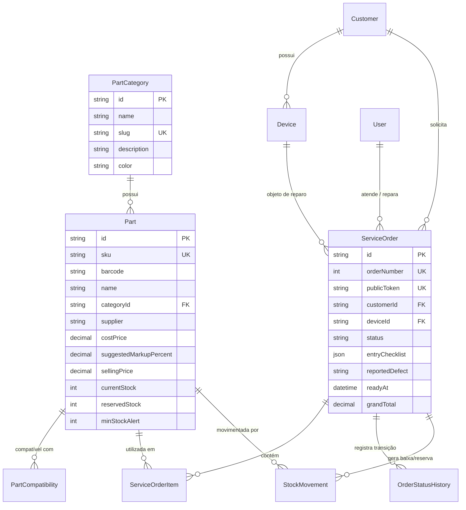
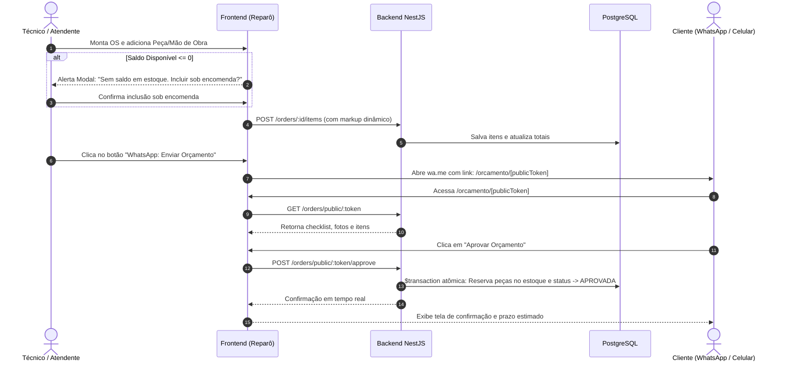

# Plano de Arquitetura & Implementação: FluxOS (MVP Refinement)

Este documento consolida o refinamento do MVP do **FluxOS (Reparô)**, mantendo os módulos fiscais congelados e focando em:
1. **Módulo de Estoque Dinâmico:** Gestão livre de categorias (`PartCategory`) e catálogo de peças (`Part`) com cálculo automático de markup, compatibilidade ampla e controle de saldo atômico.
2. **Ciclo de OS & Precificação Inteligente:** Checklist cosmético/funcional com fotos, cálculo dinâmico de margem e alerta de estoque zero (sob encomenda).
3. **Portal Público do Cliente & Ações de WhatsApp:** Link seguro `/orcamento/[publicToken]` para aprovação remota pelo cliente e botões contextuais `wa.me/` (incluindo alerta de retirada pendente >48h).
4. **Design System TurmaPay:** Header fixo no topo, cards `shadow-none`, abas com container `bg-white`, inputs padronizados em `h-9` e microinterações de alta conversão.

---

## User Review Required

> [!IMPORTANT]
> **Migração de Categorias no Banco de Dados:**
> Atualmente, a tabela `parts` armazena `category` como uma `String` estática. Com a introdução de `PartCategory`, faremos uma migration que:
> 1. Cria a tabela `part_categories` (`id`, `name`, `slug`, `description`, `color`, `createdAt`, `updatedAt`).
> 2. Popula as categorias padrão existentes (`Telas`, `Baterias`, `Conectores`, `Câmeras`, `Carcaças`, `Placas/Chips`, `Insumos`).
> 3. Adiciona a coluna `categoryId` em `parts` como chave estrangeira obrigatória (com `onDelete: Restrict`).

> [!IMPORTANT]
> **Condições da Carcaça no Checklist:**
> O checklist agora suporta formalmente as 5 opções do novo requisito: `PERFEITO`, `BOM`, `MARCAS_DE_USO`, `TRINCADO`, `AMASSADO`.

> [!NOTE]
> **Portal Público do Cliente:**
> A rota `/orcamento/[publicToken]` será completamente pública (sem necessidade de login), renderizando os dados da OS com base em um token único UUID v4 (`publicToken`), permitindo aprovação ou recusa do orçamento pelo cliente diretamente pelo celular.

---

## 1. Arquitetura e Diagramas de Fluxo

### 1.1 Modelo Entidade-Relacionamento (ERD Atualizado)



---

### 1.2 Fluxo de Orçamentação, Ruptura e Aprovação Remota



---

## 2. Mudanças Propostas no Banco de Dados (`packages/database`)

### [MODIFY] `packages/database/prisma/schema.prisma`

```prisma
model PartCategory {
  id          String   @id @default(uuid())
  name        String   @unique
  slug        String   @unique
  description String?
  color       String   @default("#3b82f6")
  createdAt   DateTime @default(now())
  updatedAt   DateTime @updatedAt

  parts       Part[]

  @@map("part_categories")
}

model Part {
  id                     String              @id @default(uuid())
  sku                    String              @unique
  barcode                String?             @unique
  name                   String
  categoryId             String
  supplier               String?
  costPrice              Decimal             @db.Decimal(10, 2)
  suggestedMarkupPercent Decimal             @default(100.0) @db.Decimal(5, 2)
  sellingPrice           Decimal             @db.Decimal(10, 2)
  currentStock           Int                 @default(0)
  reservedStock          Int                 @default(0)
  minStockAlert          Int                 @default(3)
  createdAt              DateTime            @default(now())
  updatedAt              DateTime            @updatedAt

  category               PartCategory        @relation(fields: [categoryId], references: [id], onDelete: Restrict)
  compatibilities        PartCompatibility[]
  movements              StockMovement[]
  orderItems             ServiceOrderItem[]

  @@index([sku])
  @@index([barcode])
  @@index([name])
  @@index([categoryId])
  @@map("parts")
}

model ServiceOrder {
  id                 String               @id @default(uuid())
  orderNumber        Int                  @unique @default(autoincrement())
  publicToken        String               @unique @default(uuid())
  customerId         String
  deviceId           String
  technicianId       String?
  attendantId        String
  status             OrderStatus          @default(CRIADA)
  entryChecklist     Json
  reportedDefect     String
  technicalReport    String?
  finalObservations  String?
  totalPartsPrice    Decimal              @default(0.0) @db.Decimal(10, 2)
  totalLaborPrice    Decimal              @default(0.0) @db.Decimal(10, 2)
  totalDiscount      Decimal              @default(0.0) @db.Decimal(10, 2)
  grandTotal         Decimal              @default(0.0) @db.Decimal(10, 2)
  readyAt            DateTime?
  approvedAt         DateTime?
  startedAt          DateTime?
  finishedAt         DateTime?
  deliveredAt        DateTime?
  createdAt          DateTime             @default(now())
  updatedAt          DateTime             @updatedAt

  customer           Customer             @relation(fields: [customerId], references: [id])
  device             Device               @relation(fields: [deviceId], references: [id])
  technician         User?                @relation("TechnicianOrders", fields: [technicianId], references: [id])
  attendant          User                 @relation("AttendantOrders", fields: [attendantId], references: [id])
  items              ServiceOrderItem[]
  stockMovements     StockMovement[]
  history            OrderStatusHistory[]

  @@index([status])
  @@index([customerId])
  @@index([deviceId])
  @@index([orderNumber])
  @@index([publicToken])
  @@map("service_orders")
}
```

---

## 3. Mudanças nos Contratos Compartilhados (`packages/contracts`)

### [NEW] `packages/contracts/src/schemas/category.schema.ts`
- `CreateCategorySchema`: nome, slug, descrição, cor hexadecimal.
- `UpdateCategorySchema`: campos parciais.
- `CategoryDTO`: representação tipada da categoria com contagem de peças associadas.

### [MODIFY] `packages/contracts/src/schemas/inventory.schema.ts`
- Atualização do schema de peças com `categoryId`, `barcode`, `supplier`, `suggestedMarkupPercent`, `currentStock`, `reservedStock`, `minStockAlert`.
- Validador de cálculo automático: `sellingPrice = costPrice * (1 + markup / 100)`.

### [MODIFY] `packages/contracts/src/schemas/checklist.schema.ts`
- Enum `CasingCondition`: `"PERFEITO" | "BOM" | "MARCAS_DE_USO" | "TRINCADO" | "AMASSADO"`.
- `cosmeticPhotos`: array de strings (URLs ou base64 para o MVP).

### [NEW] `packages/contracts/src/schemas/public-order.schema.ts`
- `PublicOrderDTO`: dados da OS expostos com segurança (sem custos de aquisição ou dados sensíveis de técnicos/outros clientes).
- `ApprovePublicOrderSchema`: confirmação do cliente com observações opcionais.

---

## 4. Mudanças no Backend NestJS (`apps/api`)

### [NEW] Módulo de Categorias (`apps/api/src/modules/categories/`)
- `categories.controller.ts`:
  - `GET /inventory/categories` (listagem com contagem de peças)
  - `POST /inventory/categories`
  - `PUT /inventory/categories/:id`
  - `DELETE /inventory/categories/:id` (impede exclusão se houver peças vinculadas)
- `categories.service.ts`: regras de validação de slug e persistência.

### [MODIFY] Módulo de Estoque (`apps/api/src/modules/inventory/`)
- Atualização do `inventory.service.ts` para suportar busca por categoria dinâmica (`categoryId`), código de barras e geração de SKU.
- Atualização do método de reserva atômica (`$transaction` com `SELECT FOR UPDATE`) para o modelo `currentStock` / `reservedStock`.

### [MODIFY] Módulo de Ordens de Serviço (`apps/api/src/modules/orders/`)
- Inclusão do campo `readyAt` ao mover para `PRONTO_RETIRADA` (para calcular atraso >48h).
- Endpoint público desprotegido (`@Public()`):
  - `GET /orders/public/:token`: busca os dados do orçamento seguro.
  - `POST /orders/public/:token/approve`: transição atômica para `APROVADA` e reserva de estoque.
  - `POST /orders/public/:token/reject`: transição para `CANCELADA`.

---

## 5. Mudanças no Frontend Next.js (`apps/web`)

### [NEW] Gestão de Categorias Dinâmicas no Estoque
- Criação de aba/modal em `src/features/inventory/components/category-manager-modal.tsx`:
  - Criação rápida de categorias com seletor de cor.
  - As abas superiores da página de estoque passam a carregar diretamente do endpoint `GET /inventory/categories`.

### [MODIFY] Modal de Adição de Itens & Precificação Inteligente
- `src/features/orders/components/add-item-modal.tsx`:
  - Exibição da fórmula: `(Custo + Mão de Obra) * Margem = Preço Sugerido`.
  - Checagem imediata de saldo: se `part.currentStock - part.reservedStock <= 0`, abre modal de aviso de encomenda:
    > *"Atenção: Peça sem saldo disponível em estoque físico. Deseja adicionar este item sob encomenda?"*

### [NEW] Portal Público do Cliente (`src/app/orcamento/[publicToken]/page.tsx`)
- Página responsiva mobile-first com a identidade visual **Reparô**:
  - Logo e identificação da assistência técnica.
  - Aparelho (Modelo, IMEI) e Defeito Relatado.
  - Visualização do Checklist de Entrada e fotos do estado do smartphone.
  - Tabela de itens cotados com garantia de 90 dias expressa.
  - Valor total e opções de pagamento.
  - Botões de ação em destaque: **"Aprovar Orçamento"** (verde) e **"Recusar Orçamento"** (outline cinza).

### [MODIFY] Ações de WhatsApp e Alerta de Retirada (>48h)
- Utilitário `src/features/orders/utils/whatsapp-helper.ts`:
  - `generateReadyMessage(order)`: mensagem de retirada com endereço da oficina.
  - `generateQuoteMessage(order, originUrl)`: mensagem com o link `/orcamento/[publicToken]`.
  - `generateOverdueMessage(order, daysOverdue)`: cobrança cordial de retirada pendente há mais de 48h.
- Em `orders-table.tsx`:
  - Se a OS estiver em `PRONTO_RETIRADA` há mais de 2 dias (48 horas a partir de `readyAt`), renderiza badge em destaque:
    `<Badge variant="destructive">Atrasado há X dias</Badge>`
  - Botão inline com ícone do WhatsApp para disparo da mensagem em 1 clique.

---

## 6. Plano de Implementação Sequencial

| Fase | Escopo | Arquivos Principais |
| :--- | :--- | :--- |
| **Fase 1** | **Database & Contracts** | `packages/database/prisma/schema.prisma`<br>`packages/contracts/src/schemas/*`<br>`packages/database/prisma/seed.ts` |
| **Fase 2** | **Backend Categorias & Estoque** | `apps/api/src/modules/categories/*`<br>`apps/api/src/modules/inventory/*` |
| **Fase 3** | **Backend OS Pública & Token** | `apps/api/src/modules/orders/orders.controller.ts`<br>`apps/api/src/modules/orders/orders.service.ts` |
| **Fase 4** | **Frontend Categorias & Precificação** | `apps/web/src/features/inventory/*`<br>`apps/web/src/features/orders/components/add-item-modal.tsx` |
| **Fase 5** | **Frontend Portal Público & WhatsApp** | `apps/web/src/app/orcamento/[publicToken]/page.tsx`<br>`apps/web/src/features/orders/components/orders-table.tsx` |
| **Fase 6** | **Testes E2E, Validação & Build** | Testes de carga, migração Prisma, verificação estrita de zero comentários. |

---

## 7. Plano de Verificação

### Testes Automatizados
- Executar `pnpm --filter @fluxos/database prisma migrate dev` para validar o schema.
- Executar `pnpm --filter @fluxos/api build` e `pnpm --filter @fluxos/web build` assegurando 0 erros de tipagem.
- Teste E2E de aprovação pública via endpoint `POST /orders/public/:token/approve`.

### Verificação Manual
1. **Categorias Dinâmicas:** Criar a categoria "Conectores Type-C", cadastrar uma nova peça com margem de 120% e verificar o cálculo automático do preço de venda.
2. **Alerta de Estoque Zero:** Tentar cotar uma peça com saldo 0 e checar a confirmação de encomenda.
3. **Portal do Cliente:** Abrir o link `/orcamento/[token]` em aba anônima, conferir o checklist e aprovar online; conferir a atualização do status na tabela de OS.
4. **WhatsApp e Atraso >48h:** Visualizar OS com `readyAt` simulado há 3 dias e checar o badge de alerta e o link `wa.me/` gerado.
